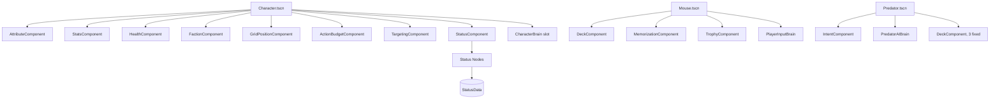

# Components

Components are the `Node`s that make up a runtime entity. A character is the **sum of its components**, not a subclass of some "Character" type. Components are small, focused, and decoupled via signals.

## Composition rule

Components on the same entity **do not call each other's methods directly**. They read each other through signal payloads, signal listeners, and small accessor methods (`get_*`) for read-only data. Writes go through signals.

This keeps components individually testable and replaceable. Adding or removing a component does not require touching its siblings.

## Core character components

These components are present on every `Character` scene (`Mouse`, `Predator`, and any future entity type).

### `AttributeComponent` (Node)

Holds the base `AttributeSet` and a list of active `AttributeModifier`s. The single source of truth for "what is this character's effective attribute right now".

| Field | Type | Notes |
| --- | --- | --- |
| `base` | `AttributeSet` | Base scores, set from `MouseClassData` or `PredatorData`. |
| `_modifiers` | `Array[AttributeModifier]` | Active modifiers (from statuses, trophies, mechanics). |

| Signal | Payload |
| --- | --- |
| `attribute_changed` | `attribute: StringName`, `old_value: int`, `new_value: int` |

| Method | Returns | Notes |
| --- | --- | --- |
| `get_value(attr)` | `int` | Final value with all modifiers applied. Returns 0 for unknown ids. |
| `modifier(attr)` | `int` | Final `get_value(attr) - 10`. |
| `add_modifier(m)` | `void` | Adds and emits `attribute_changed` if the value changed. |
| `remove_modifiers_from(source)` | `int` | Removes every modifier whose `source` matches; returns count removed. |

### `StatsComponent` (Node)

Holds derived combat stats: level, XP, current/max energy, and initiative. Reads attributes from `AttributeComponent` to recompute the energy cap. HP lives on `HealthComponent` — this component does not know `max_hp`.

| Field | Type | Notes |
| --- | --- | --- |
| `level` | `int` | Character level. |
| `xp` | `int` | XP accumulated since last level-up. |
| `xp_to_next` | `int` | XP threshold for the next level. |
| `max_energy` | `int` | Recomputed from `INT` and class base. |
| `current_energy` | `int` | Capped at `max_energy`. |
| `initiative` | `int` | Set from `DEX` once, on biome instantiation. |

| Signal | Payload |
| --- | --- |
| `level_up` | `new_level: int` |
| `xp_gained` | `amount: int` |
| `energy_changed` | `current: int`, `max: int` |
| `max_changed` | `which: StringName`, `value: int` |

| Method | Returns | Notes |
| --- | --- | --- |
| `init(max_energy_base, attribute_component)` | `void` | Wires the energy base and the attribute dependency. Required before `recompute_max_energy`. |
| `gain_xp(n)` | `void` | Adds XP; calls `level_up_if_ready` if threshold crossed. |
| `level_up_if_ready()` | `bool` | True if a level was actually gained. |
| `spend_energy(n)` | `bool` | True if the spend succeeded. |
| `gain_energy(n)` | `void` | Capped at `max_energy`. |
| `recompute_max_energy()` | `void` | Reads `AttributeComponent` and `_max_energy_base`. Emits `max_changed(&"max_energy", ...)`. |
| `set_initiative_from_dex()` | `void` | Called once per biome instantiation. |

### `HealthComponent` (Node)

The single owner of all HP state: current HP, temporary HP, the max-HP cap, and the wounded/dead transitions. Receives damage from `DamageExecutor` and heals from `HealExecutor`; never reads from damage sources directly.

| Field | Type | Notes |
| --- | --- | --- |
| `current_hp` | `int` | Cannot go below 0. |
| `temp_hp` | `int` | Cannot go below 0. Lost first on damage. |
| `max_hp` | `int` | Recomputed from `CON` modifier and the base provided to `init()`. |

| Signal | Payload |
| --- | --- |
| `hp_changed` | `current: int`, `max: int` |
| `temp_hp_changed` | `current: int` |
| `wounded_state_changed` | `is_wounded: bool` |
| `died` | `cause: StringName`, `killer: Node` (may be null) |

| Method | Returns | Notes |
| --- | --- | --- |
| `init(max_hp_base, attribute_component)` | `void` | Wires the HP base and the attribute dependency. Required before `recompute_max_hp`. |
| `recompute_max_hp()` | `void` | `max_hp = max_hp_base + CON modifier`. Emits `hp_changed` if the cap changed. |
| `set_max_hp(value)` | `void` | Direct setter. Used by tests; production code prefers `recompute_max_hp`. |
| `apply_damage(amount, source)` | `int` | Returns actual damage taken after temp HP. |
| `apply_heal(amount)` | `int` | Returns amount actually healed. |
| `grant_temp_hp(amount)` | `void` | Replaces if greater, by GDD rule. |
| `is_wounded()` | `bool` | True at half HP or less. |
| `is_dead()` | `bool` | True at 0 HP. |
| `reset()` | `void` | Resets to a fresh-state empty component. |

### `FactionComponent` (Node)

| Field | Type | Notes |
| --- | --- | --- |
| `faction` | `StringName` | `mouse`, `predator`, or `neutral`. |

| Method | Returns | Notes |
| --- | --- | --- |
| `is_hostile_to(other)` | `bool` | Mouse vs predator: hostile. Same faction: not. Default: not. |

### `GridPositionComponent` (Node)

| Field | Type | Notes |
| --- | --- | --- |
| `cell` | `Vector2i` | Current tile. |
| `is_blocking` | `bool` | If true, other entities cannot enter. |

| Signal | Payload |
| --- | --- |
| `cell_changed` | `old: Vector2i`, `new: Vector2i` |

| Method | Returns | Notes |
| --- | --- | --- |
| `set_cell(c)` | `bool` | False if the tile is occupied or blocked. Updates `GridSystem`. |
| `try_move(direction, grid)` | `bool` | Convenience for the move action. |

### `ActionBudgetComponent` (Node)

Tracks how many actions of each type have been spent in the current turn. The turn manager reads this to decide whether the next action is legal.

| Field | Type | Notes |
| --- | --- | --- |
| `_used` | `Dictionary` | Maps `StringName` action type to int. |

| Method | Returns | Notes |
| --- | --- | --- |
| `can_perform(type)` | `bool` | One action per turn is the default rule. |
| `spend(type)` | `bool` | Records a spend. |
| `reset` | `void` | Called at the start of the entity's turn. |

### `TargetingComponent` (Node)

Owns the geometry queries the rest of the game uses: reachability, area shape, and line of sight. Stateless except for the grid reference.

| Field | Type | Notes |
| --- | --- | --- |
| `grid_ref` | `NodePath` | Reference to `GridSystem`. |

| Method | Returns | Notes |
| --- | --- | --- |
| `reachable_tiles(max_range)` | `Array[Vector2i]` | Tiles this entity can target. |
| `area_tiles(center, shape, size)` | `Array[Vector2i]` | Tiles affected by an AoE. |
| `line_of_sight(a, b)` | `bool` | True if no blocking tile lies between. |

### `StatusComponent` (Node)

Owns the list of active statuses. Each status is a child `Status` Node, so status behavior is composed, not subclassed.

| Field | Type | Notes |
| --- | --- | --- |
| `_statuses` | `Array[Status]` | Children, one per active application. |

| Signal | Payload |
| --- | --- |
| `status_applied` | `data: StatusData` |
| `status_removed` | `data: StatusData` |
| `status_ticked` | `data: StatusData` |

| Method | Returns | Notes |
| --- | --- | --- |
| `apply_status(data)` | `void` | Honours `stack_policy`. |
| `remove_status(id)` | `void` | Removes all instances of that id. |
| `has(id)` | `bool` | |
| `tick_end_of_turn` | `void` | Called by `TurnManager` at end of the bearer's turn. |

#### `Status` (Node, child of `StatusComponent`)

A live instance of a `StatusData` on a character.

| Field | Type | Notes |
| --- | --- | --- |
| `data` | `StatusData` | Configuration. |
| `_remaining` | `int` | Turns left. |

| Signal | Payload |
| --- | --- |
| `applied` | (none) |
| `ticked` | (none) |
| `expired` | (none) |

| Method | Returns | Notes |
| --- | --- | --- |
| `apply_to(character)` | `void` | Pushes modifiers, runs `on_apply_hooks`. |
| `tick` | `void` | Decrements, runs `on_tick_hooks`, expires at 0. |
| `expire` | `void` | Removes modifiers, runs `on_expire_hooks`. |

The duration decrement happens **inside the bearer's end-of-turn tick**, not in a global timer, so a benefit applies on the turn it was gained and a detriment lasts at least one full turn.

## Mouse-only components

### `DeckComponent` (Node)

The player's deck, hand, discard pile, environmental hand, and reload charges. Tracks combat-only flags like "exhausted this combat".

| Field | Type | Notes |
| --- | --- | --- |
| `deck` | `Array[CardData]` | Cards not in hand. |
| `hand` | `Array[CardData]` | Cards playable right now. |
| `discard` | `Array[CardData]` | Cards already played or discarded. |
| `environmental_hand` | `Array[CardData]` | Single-use biome cards; do not count toward hand size. |
| `reload_charges` | `int` | 0–3. |
| `max_hand_size` | `int` | `4 + floor((INT - 10) / 4)`. |
| `exhausted_this_combat` | `Array[StringName]` | Card ids removed for the combat. |

| Signal | Payload |
| --- | --- |
| `hand_changed` | (none) |
| `deck_changed` | (none) |
| `reload_charges_changed` | `charges: int` |

| Method | Returns | Notes |
| --- | --- | --- |
| `draw(n)` | `void` | Reshuffles discard into deck if needed. |
| `discard_from_hand(c)` | `void` | |
| `add_to_deck(c)` | `void` | Up to 16. |
| `remove_from_deck(c)` | `void` | Returns card to learned-cards pool. |
| `memorize(c)` | `void` | Adds to `MemorizationComponent.memorized_cards`. |
| `forget_memorized` | `void` | Called when leaving a biome. |

Cards are reference-counted `Resource` instances. Duplicates in the deck are simply multiple references to the same `CardData` (or to different `CardData` instances if the same card is authored twice with different `id` values for clarity).

### `MemorizationComponent` (Node)

The list of cards the mouse has seen this biome and the persistent list of cards learned this run.

| Field | Type | Notes |
| --- | --- | --- |
| `memorized_cards` | `Array[CardData]` | Wiped between biomes. |
| `learned_cards` | `Array[CardData]` | Persistent for the run. |

| Signal | Payload |
| --- | --- |
| `memorized` | `card: CardData` |
| `learned` | `card: CardData` |
| `forgot` | (none) |

| Method | Returns | Notes |
| --- | --- | --- |
| `memorize(c)` | `void` | |
| `learn(c)` | `bool` | True if essence was available and spent. |
| `forget_all_memorized` | `void` | Called when leaving a biome. |

### `TrophyComponent` (Node)

Holds the trophy slots and the currently-imbued trophies. Each imbued trophy contributes a `Characteristic` to the mouse.

| Field | Type | Notes |
| --- | --- | --- |
| `slots` | `Array[TrophyData]` | Length derived from `StatsComponent.level` (3 at level 1; +1 at 3, 5, 7). |

| Signal | Payload |
| --- | --- |
| `trophy_imbued` | `trophy: TrophyData`, `slot: int` |
| `trophy_unbound` | `trophy: TrophyData`, `slot: int` |
| `characteristic_changed` | (none) |

| Method | Returns | Notes |
| --- | --- | --- |
| `imbue(trophy, slot)` | `bool` | |
| `unbind(slot)` | `void` | |
| `get_active_characteristics` | `Array[Characteristic]` | |
| `recompute_slots(level)` | `void` | Called on level-up. |

## Predator-only components

### `IntentComponent` (Node)

Stores the predator's pre-announced action plan and the tiles it will affect. The UI reads this to draw the intent overlay.

| Field | Type | Notes |
| --- | --- | --- |
| `current_intent` | `ActionPlan` | The plan to be executed. |

| Signal | Payload |
| --- | --- |
| `intent_published` | `plan: ActionPlan` |
| `intent_cleared` | (none) |

| Method | Returns | Notes |
| --- | --- | --- |
| `publish(plan)` | `void` | Called during `ENEMY_PLANNING`. |
| `clear` | `void` | Called after execution. |
| `get_affected_tiles` | `Array[Vector2i]` | Drives the UI overlay. |

## World entities (non-character)

### `CorpseComponent` (Node)

Lives on `Corpse.tscn`. Has limited HP, links back to the `PredatorData` it came from, and is the loot target.

| Field | Type | Notes |
| --- | --- | --- |
| `current_hp` | `int` | |
| `essence_remaining` | `int` | |
| `linked_predator_data` | `PredatorData` | |

| Signal | Payload |
| --- | --- |
| `destroyed` | (none) |

| Method | Returns | Notes |
| --- | --- | --- |
| `apply_damage_to_corpse(amount)` | `bool` | True if destroyed. |
| `loot(player)` | `Dictionary` | Returns `{xp, essence, trophy}`. |

## Brain slot

Every `Character.tscn` has a child slot for a `CharacterBrain` script. The brain decides what the entity does on its turn. The two concrete brains are described in `entities.md`.

## Composition diagram

