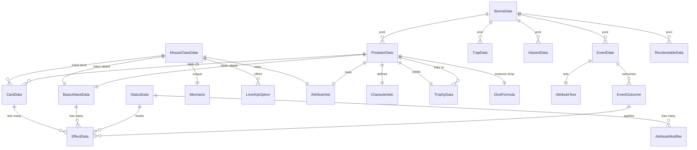

# Data Model

All persistent content and configuration is held in `Resource` types. Resources are inert, serializable, reference-counted, and editable in the Godot inspector. They contain data only; behavior lives in components and executors.

**Content location**: each `Resource` type's `.tres` files live next to the theme's `.gd` scripts. Example: `attribute/attribute_data.gd` is paired with `attribute/strength.tres`, `attribute/dexterity.tres`, etc. There is no top-level `data/` folder. The `Registry` autoload walks each theme folder to index resources at boot.

## Attribute and modifier primitives

### `AttributeData` (Resource)

The definition of one attribute. One `.tres` per attribute, located in `attribute/`. Adding a new attribute means adding a new file here plus a new constant in `AttributeIds`; the rest of the system picks it up automatically.

| Field | Type | Notes |
| --- | --- | --- |
| `id` | `StringName` | Canonical id (`&"strength"`, `&"dexterity"`, ...). Must match a constant in `AttributeIds`. |
| `display_name` | `String` | Human-readable name shown in UI. |
| `description` | `String` | Human-readable description shown in tooltips and codex. |
| `icon` | `Texture2D` | UI icon. Optional. |
| `default_value` | `int` | Default score for a fresh `AttributeSet`. Default: 10. |

### `AttributeSet` (Resource)

A character's per-attribute values. Backed by a `Dictionary[StringName, int]` so a new attribute only requires a new `AttributeData` resource — no new fields, no rebuilds.

| Field | Type | Notes |
| --- | --- | --- |
| `values` | `Dictionary[StringName, int]` | `id` → score. Empty by default; populate per-character from class or predator data. |

| Method | Returns | Notes |
| --- | --- | --- |
| `get_value(attr)` | `int` | Returns 0 for any attribute id not in `values`. |
| `set_value(attr, value)` | `void` | Writes one entry. |
| `modifier(attr)` | `int` | `get_value(attr) - 10`. Matches the D&D-style modifier formula. |

### `DiceFormula` (Resource)

A `XdY + Z` dice expression, e.g. `3d8 + 5`.

| Field | Type | Notes |
| --- | --- | --- |
| `count` | `int` | Number of dice. |
| `die` | `int` | Die size, one of `4, 6, 8, 10, 12, 20`. |
| `bonus` | `int` | Flat modifier added to the sum. |

Supports `roll(rng)`, `max_roll()`, and `average_roll()`. Critical hits use `max_roll()`.

### `AttributeModifier` (Resource)

A delta applied to one attribute of one `AttributeComponent`. Designed to be added on status apply and removed on status expire without ambiguity.

| Field | Type | Notes |
| --- | --- | --- |
| `attribute` | `StringName` | Which attribute is modified. |
| `mode` | `StringName` | `add`, `multiply`, or `set`. |
| `value` | `float` | Magnitude. |
| `source` | `StringName` | ID of the originator (a status id, a trophy id, ...). Used for removal. |

## Effect system data

### `EffectData` (Resource, polymorphic base)

The base type for all effect data. The concrete subclass is identified by `type_id`, a `StringName` that the `Registry` uses to look up an executor.

| Field | Type | Notes |
| --- | --- | --- |
| `description` | `String` | Human-readable explanation. |
| `tags` | `Array[StringName]` | Free-form tags for filtering and UI (`damage`, `physical`, `fire`, ...). |
| `type_id` | `StringName` | Subclass-overridden constant; looked up in `Registry`. |

#### Concrete effect data types

Each is a `Resource` subclass of `EffectData` with the listed additional fields.

| Class | Additional fields |
| --- | --- |
| `DamageEffectData` | `dice: DiceFormula`, `scaling_attribute: StringName`, `damage_type: StringName` (`physical` or `special`), `resistance_attribute: StringName`. |
| `HealEffectData` | `dice: DiceFormula`. |
| `GrantTempHpEffectData` | `amount: int`. |
| `ApplyStatusEffectData` | `status: StatusData`, `chance: float` (0.0–1.0). |
| `PushEffectData` | `distance: int`. |
| `JumpEffectData` | `max_distance: int`. |
| `DrawCardsEffectData` | `count: int`. |
| `ModifyAttributeEffectData` | `attribute: StringName`, `delta: int`, `duration: int`. |
| `CompositeEffectData` | `effects: Array[EffectData]`, `mode: StringName` (`sequence` or `all`). |
| `AreaEffectData` | `inner: EffectData`, `area_shape: StringName`, `area_size: int`. |

A card with multiple effects is a `CardData` whose `effects` array contains several `EffectData` entries, optionally wrapped in `CompositeEffectData` when sequencing metadata is needed.

## Status data

### `StatusData` (Resource)

A persistent condition applied to a character. The runtime instance is a `Status` Node child of the target's `StatusComponent`.

| Field | Type | Notes |
| --- | --- | --- |
| `id` | `StringName` | Unique identifier. |
| `name` | `String` | Display name. |
| `description` | `String` | Display description. |
| `duration` | `int` | Initial duration in turns. |
| `stack_policy` | `StringName` | `replace` (default), `stack`, or `ignore`. |
| `modifiers` | `Array[AttributeModifier]` | Attribute changes applied while the status is active. |
| `on_apply_hooks` | `Array[EffectData]` | Effects resolved when the status is gained. |
| `on_tick_hooks` | `Array[EffectData]` | Effects resolved at end-of-turn tick. |
| `on_expire_hooks` | `Array[EffectData]` | Effects resolved when the status expires. |
| `tags` | `Array[StringName]` | Free-form tags. |

## Cards and basic attacks

### `CardData` (Resource)

| Field | Type | Notes |
| --- | --- | --- |
| `id` | `StringName` | Unique identifier. |
| `name` | `String` | Display name. |
| `description` | `String` | Display description. |
| `energy_cost` | `int` | Cost paid from `StatsComponent.current_energy`. |
| `family` | `StringName` | Animal family; relevant for some trophies and traits. |
| `type` | `StringName` | `attack`, `defense`, or `special`. |
| `range` | `int` | Maximum distance in tiles. |
| `range_shape` | `StringName` | Shape of the reach pattern (default: line). |
| `area_shape` | `StringName` | Shape of the area at the target tile (default: single). |
| `area_size` | `int` | Magnitude of the area. |
| `effects` | `Array[EffectData]` | The effects produced when played. |
| `scaling_attributes` | `Array[StringName]` | Attributes that scale the roll and/or the damage. |
| `exhaust` | `bool` | If true, the card is removed from the deck for the rest of the combat. |
| `tags` | `Array[StringName]` | Free-form tags. |

### `BasicAttackData` (Resource)

The free, always-available attack of a character. Always physical.

| Field | Type | Notes |
| --- | --- | --- |
| `name` | `String` | Display name. |
| `description` | `String` | Display description. |
| `range` | `int` | Maximum distance in tiles. |
| `area_shape` | `StringName` | Default: single. |
| `area_size` | `int` | Default: 1. |
| `effects` | `Array[EffectData]` | One or more effects (typically one `DamageEffectData`). |
| `scaling_attributes` | `Array[StringName]` | Usually the attacker's primary physical attribute. |
| `tags` | `Array[StringName]` | Free-form tags. |

## Characteristics and mechanics

### `Characteristic` (Resource, polymorphic base)

A passive or reactive trait attached to a predator and, when the player binds the related trophy, to the mouse.

| Field | Type | Notes |
| --- | --- | --- |
| `id` | `StringName` | Unique identifier. |
| `name` | `String` | Display name. |
| `description` | `String` | Display description. |

#### Concrete characteristic types

| Class | Additional fields | Behavior |
| --- | --- | --- |
| `StatModifierCharacteristic` | `modifiers: Array[AttributeModifier]` | Always-on attribute changes. |
| `ReactionCharacteristic` | `trigger: StringName`, `effect: EffectData` | Resolves the effect when the trigger event is observed on `EventBus`. |
| `AuraCharacteristic` | `tick_interval: int`, `effect: EffectData` | Periodic effect around the bearer. |

### `Mechanic` (Resource, polymorphic base)

A class-unique ability for the mouse. Lives on the player's `Character` once a class is selected.

| Field | Type | Notes |
| --- | --- | --- |
| `id` | `StringName` | Unique identifier. |
| `name` | `String` | Display name. |
| `description` | `String` | Display description. |

#### Concrete mechanic types

| Class | Additional fields |
| --- | --- |
| `BonusReloadMechanic` | `extra_reload_charges: int`. |
| `TrophyPowerMechanic` | `trophy_effect_multiplier: float`. |
| `FirstCardFreeMechanic` | `card_id: StringName`. |

### `LevelUpOption` (Resource, polymorphic base)

A reward presented at a `RestZone` when the mouse levels up.

| Field | Type | Notes |
| --- | --- | --- |
| `id` | `StringName` | Unique identifier. |
| `name` | `String` | Display name. |
| `description` | `String` | Display description. |
| `min_level` | `int` | Lowest level at which this option can be chosen. |

#### Concrete option types

| Class | Additional fields |
| --- | --- |
| `StatPointOption` | `attribute: StringName`, `amount: int`. |
| `InnateCardOption` | `card: CardData`. |
| `CharacteristicOption` | `characteristic: Characteristic`. |

## Predators and mice

### `PredatorData` (Resource)

Defines a predator species: stats, basic attack, deck, characteristic, danger, and the linked trophy.

| Field | Type | Notes |
| --- | --- | --- |
| `id` | `StringName` | Unique identifier. |
| `name` | `String` | Display name. |
| `family` | `StringName` | `mammal`, `bird`, `herptile`, `invertebrate`. |
| `attributes` | `AttributeSet` | Base attribute scores. |
| `max_hp_base` | `int` | Base hit points (CON scaling applied at runtime). |
| `basic_attack` | `BasicAttackData` | The free attack. |
| `deck` | `Array[CardData]` | Exactly three cards, by GDD. |
| `characteristic` | `Characteristic` | The species-defining trait. |
| `danger_level` | `StringName` | `alto`, `muy_alto`, `letal`. |
| `trophy_data` | `TrophyData` | The trophy yielded on death. |
| `essence_drop` | `DiceFormula` | Base essence; final value depends on `WIS` and rolls. |
| `xp_reward` | `int` | XP granted on defeat. |

### `MouseClassData` (Resource)

Defines a mouse class: stats, basic attack, starting deck, class-unique mechanic, and level-up options.

| Field | Type | Notes |
| --- | --- | --- |
| `id` | `StringName` | Unique identifier. |
| `name` | `String` | Display name. |
| `description` | `String` | Display description. |
| `attributes` | `AttributeSet` | Base attribute scores. |
| `basic_attack` | `BasicAttackData` | The free attack. |
| `initial_deck` | `Array[CardData]` | Cards the run starts with. |
| `unique_mechanic` | `Mechanic` | The class's signature ability. |
| `max_energy_base` | `int` | Used by `floor((INT - 10) / 2) + base`. |
| `max_hp_base` | `int` | Used by `CON` scaling. |
| `level_up_options` | `Array[LevelUpOption]` | All options this class can ever be offered. |

## Trophies

### `TrophyData` (Resource)

| Field | Type | Notes |
| --- | --- | --- |
| `id` | `StringName` | Unique identifier. |
| `name` | `String` | Display name. |
| `description` | `String` | Display description. |
| `linked_predator` | `PredatorData` | The species this trophy came from. |
| `imbue_essence_cost` | `int` | Essence required to imbue. |
| `icon` | `Texture2D` | Display icon. |

## Biomes and world content

### `BiomeData` (Resource)

| Field | Type | Notes |
| --- | --- | --- |
| `id` | `StringName` | Unique identifier. |
| `name` | `String` | Display name. |
| `biome_index` | `int` | 1 through 5 in a run; used by difficulty scaling. |
| `min_danger` | `StringName` | Minimum predator danger level allowed. |
| `predator_pool` | `Array[PredatorData]` | Predators eligible for this biome. |
| `trap_pool` | `Array[TrapData]` | Traps eligible for this biome. |
| `hazard_pool` | `Array[HazardData]` | Hazards eligible for this biome. |
| `event_pool` | `Array[EventData]` | Events eligible for this biome. |
| `recolectable_pool` | `Array[RecolectableData]` | Recollectables eligible for this biome. |
| `grid_size` | `Vector2i` | Width and height in tiles. |
| `is_boss_room` | `bool` | Marks the final-boss room (set on a separate `BiomeData` instance). |

### `TrapData` (Resource)

| Field | Type | Notes |
| --- | --- | --- |
| `id` | `name` | `description` | `trigger: StringName` (`on_step` or `on_adjacent`) | `effects: Array[EffectData]`. |

### `HazardData` (Resource)

| Field | Type | Notes |
| --- | --- | --- |
| `id` | `name` | `description` | `area_shape: StringName` | `area_size: int` | `tick_interval: int` | `move_speed: int` | `effects: Array[EffectData]`. |

### `RecolectableData` (Resource)

| Field | Type | Notes |
| --- | --- | --- |
| `id` | `name` | `description` | `effects_on_pickup: Array[EffectData]` | `is_consumable: bool`. |

### `EventData` (Resource)

| Field | Type | Notes |
| --- | --- | --- |
| `id` | `name` | `description` | `attribute_test: AttributeTest` | `outcomes: Array[EventOutcome]`. |

### `AttributeTest` (Resource)

| Field | Type | Notes |
| --- | --- | --- |
| `attribute` | `StringName` | Which attribute is rolled. |
| `difficulty` | `int` | DC. |
| `modifier` | `int` | Flat bonus to the roll (often 0). |

### `EventOutcome` (Resource)

| Field | Type | Notes |
| --- | --- | --- |
| `success` | `bool` | If true, this outcome applies on test success. |
| `effects` | `Array[EffectData]` | Effects applied to the player on this outcome. |
| `description` | `String` | Display text. |

### `RestZoneData` (Resource)

| Field | Type | Notes |
| --- | --- | --- |
| `id` | `name` | `available_actions: Array[StringName]` (subset of the canonical rest actions) | `is_starting_zone: bool`. |

## Data-level relationships

