# Entities

Entities are scenes, not classes. They compose components. The two important entity types — the mouse and the predator — share the same `Character` scene root and differ only by which components they include and which `Brain` script is attached to the brain slot.

There is no `Mouse extends Character` or `Predator extends Character` in the script hierarchy. Composition is the only mechanism.

## `Character.tscn` (base scene)

A `Character.tscn` is a `Node` with a fixed set of children. It is the smallest unit that exists in the world as an "actor".

### Children

| Node | Type | Present on every character |
| --- | --- | --- |
| `AttributeComponent` | `Node` | yes |
| `StatsComponent` | `Node` | yes |
| `HealthComponent` | `Node` | yes |
| `FactionComponent` | `Node` | yes |
| `GridPositionComponent` | `Node` | yes |
| `ActionBudgetComponent` | `Node` | yes |
| `TargetingComponent` | `Node` | yes |
| `StatusComponent` | `Node` | yes |
| `BrainSlot` | `Node` (placeholder for the brain script) | yes |

The `BrainSlot` is an empty `Node` whose script is set when the entity is instantiated. The slot exists so the same scene structure works for both player and AI.

### Exports

| Export | Type | Notes |
| --- | --- | --- |
| `display_name` | `String` | Shown in UI. |
| `faction` | `StringName` | Copied to `FactionComponent` on `_ready`. |
| `attribute_set` | `AttributeSet` | Copied to `AttributeComponent.base` on `_ready`. |
| `max_hp_base` | `int` | Used by `HealthComponent.recompute_max_hp` on `_ready`. |
| `brain_scene` | `PackedScene` | Instantiated as a child of `BrainSlot` on `_ready`. |

The base scene has no behavior beyond wiring these exports into the components. Anything specific to a mouse or a predator lives in the inherited scene or in the brain.

## `Mouse.tscn` (inherits `Character.tscn`)

Adds the player-specific components and the player brain.

### Additional children

| Node | Type | Notes |
| --- | --- | --- |
| `DeckComponent` | `Node` | Owns deck/hand/discard/environmental cards. |
| `MemorizationComponent` | `Node` | Memorized and learned cards. |
| `TrophyComponent` | `Node` | Trophy slots and active characteristics. |
| `HandUIAnchor` | `Marker2D` | Where the `HandUI` scene positions itself relative to the character. |
| `PlayerInputBrain` | attached to `BrainSlot` | Reads `InputService` intents. |

### Additional exports

| Export | Type | Notes |
| --- | --- | --- |
| `class_data` | `MouseClassData` | Drives `initial_deck`, `unique_mechanic`, level-up options. |
| `basic_attack` | `BasicAttackData` | Set from `class_data` at instantiation. |

### `_ready` order

1. `Mouse._ready` runs after `Character._ready` (which has wired the core components).
2. Apply `class_data.attributes` to `AttributeComponent.base`.
3. Apply `class_data.initial_deck` to `DeckComponent.deck` and call `DeckComponent.shuffle`.
4. Apply `class_data.basic_attack` to the basic-attack reference used by `BasicAttackExecutor`.
5. Attach `class_data.unique_mechanic` to the mouse (the mechanic registers its hooks with the relevant component and `EventBus`).
6. `HealthComponent.init(class_data.max_hp_base, attribute_component)` then `recompute_max_hp()`; `StatsComponent.init(class_data.max_energy_base, attribute_component)` then `recompute_max_energy()`.
7. `HealthComponent.current_hp = max_hp`.
8. `StatsComponent.current_energy = max_energy`.

## `Predator.tscn` (inherits `Character.tscn`)

### Additional children

| Node | Type | Notes |
| --- | --- | --- |
| `IntentComponent` | `Node` | Holds the predator's pre-announced plan. |
| `DeckComponent` | `Node` | Read-only: holds the three fixed cards and a hand of size 3. |
| `PredatorAIBrain` | attached to `BrainSlot` | Plans turns. |

### Additional exports

| Export | Type | Notes |
| --- | --- | --- |
| `data` | `PredatorData` | Drives attributes, HP, basic attack, deck, characteristic. |
| `instance_level` | `int` | Optional, used to scale the predator in the boss room. |

### `_ready` order

1. Run `Character._ready`.
2. Apply `data.attributes` to `AttributeComponent.base`.
3. Apply `data.basic_attack` to the basic-attack reference.
4. Apply `data.deck` to `DeckComponent.deck`; hand size is fixed at 3.
5. Hand starts full: 3 cards drawn from the 3-card deck.
6. Apply `data.characteristic` — `StatModifierCharacteristic` adds modifiers to `AttributeComponent`; `ReactionCharacteristic` and `AuraCharacteristic` register hooks with `EventBus` or with `StatusComponent`.
7. `HealthComponent.recompute_max_hp`; `HealthComponent.current_hp = max_hp`.
8. `StatsComponent.set_initiative_from_dex` is called by `BiomeGenerator` once it places the predator in the grid.

## `Corpse.tscn` (does not inherit `Character.tscn`)

A dead predator becomes a corpse. A corpse is a `Node` with a `FactionComponent` of `corpse`, a `GridPositionComponent`, and a `CorpseComponent`. It is not a `Character` because it cannot act, has no brain, and is lootable until destroyed.

| Node | Type | Notes |
| --- | --- | --- |
| `FactionComponent` | `Node` | `faction = "corpse"`. |
| `GridPositionComponent` | `Node` | `is_blocking = true` (occupies a tile). |
| `CorpseComponent` | `Node` | Holds HP, essence, and the `PredatorData` reference. |

## The brain slot

`CharacterBrain` is a `Node` (or `RefCounted` depending on language ergonomics) with one method:

| Method | Returns | Notes |
| --- | --- | --- |
| `decide_action(state) -> ActionPlan` | `ActionPlan` | Or `null` to indicate "wait". |

### `PlayerInputBrain`

- Subscribes to `InputService` signals.
- Maintains a small per-turn state: `pending_plan`, `targeting_in_progress`.
- Builds the `ActionPlan` from the most recent intents.
- Pushes the plan to `TurnManager` via its public `submit_player_action(plan)` API.

### `PredatorAIBrain`

| Field | Type | Notes |
| --- | --- | --- |
| `data` | `PredatorData` | Source of stats and capabilities. |
| `_current_plan` | `ActionPlan` | Set during planning, read during resolving. |

| Method | Returns | Notes |
| --- | --- | --- |
| `plan_turn(state) -> ActionPlan` | `ActionPlan` | Generates candidates, scores them, returns the best. Also publishes it to `IntentComponent`. |
| `score_candidate(c, state)` | `float` | Utility function. Higher is better. |

The scoring function is intentionally simple in the vertical slice: distance to the player, expected damage, and survival heuristic. Improvements (line of sight, threat awareness, area denial) are out of slice.

The brain **never reads `InputService`**. It only reads the world via `GridSystem`, the player's `Character` node (discovered through `FactionComponent`), and its own components.

## Why no `Mouse` or `Predator` class

The temptation is:

```
class_name Mouse extends Character
class_name Predator extends Character
```

Problems with that:

- `Mouse` and `Predator` are **scenes**, not classes. They have different child nodes.
- The differences between a venomous predator and a non-venomous one are **data** (`Characteristic`), not class. Subclassing would force a new class per characteristic combination, exploding the type tree.
- Adding a new entity type (e.g., a summoned creature) should require zero code changes — only a new `BiomeData` entry and a `PackedScene` file. Inheritance would force new code each time.

The scene-inheritance mechanism in Godot gives us structural reuse without the class hierarchy. The exported `attribute_set`, `class_data`, and `data` fields are the configuration that turns a generic `Character.tscn` into a specific instance.

## Composition summary

```mermaid
graph TD
    Character[Character.tscn]
    Character --> AttributeComponent
    Character --> StatsComponent
    Character --> HealthComponent
    Character --> FactionComponent
    Character --> GridPositionComponent
    Character --> ActionBudgetComponent
    Character --> TargetingComponent
    Character --> StatusComponent
    Character --> BrainSlot[BrainSlot]

    Mouse[Mouse.tscn inherits Character]
    Mouse --> DeckComponent
    Mouse --> MemorizationComponent
    Mouse --> TrophyComponent
    Mouse --> PlayerBrain[PlayerInputBrain in BrainSlot]
    Mouse -.config.-> MCD[MouseClassData]

    Predator[Predator.tscn inherits Character]
    Predator --> IntentComponent
    Predator --> PredatorDeck[DeckComponent, 3 cards]
    Predator --> PredatorBrain[PredatorAIBrain in BrainSlot]
    Predator -.config.-> PD[PredatorData]

    Corpse[Corpse.tscn]
    Corpse --> CorpseComponent
    Corpse --> GridPositionComponent
    Corpse --> FactionComponent
```


