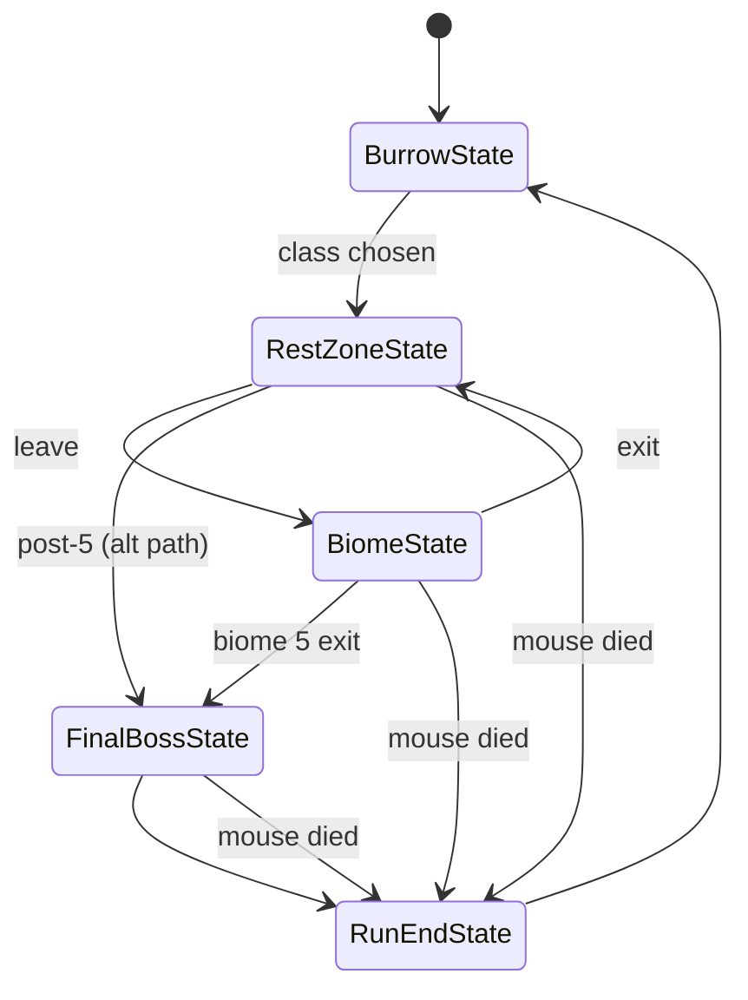
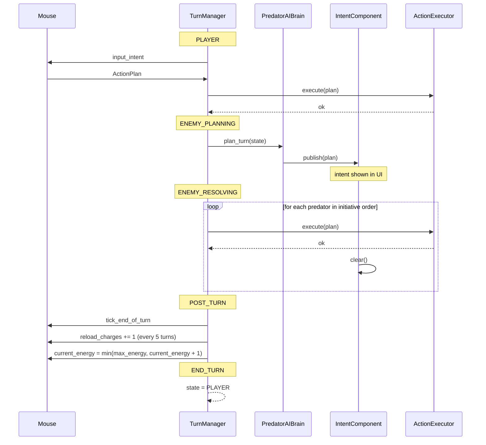

# Run Flow

The game's macro-flow and micro-flow live in two cooperating state machines: the `RunStateMachine` (Burrow → Rest → Biome → ... → RunEnd) and the `TurnManager` (Player → Enemy Planning → Enemy Resolving → Post-turn).

Both are `Node`s. `RunStateMachine` is an autoload; `TurnManager` is constructed per combat by the combat scene (the `Biome` or `Combat` root). The per-state objects are `RefCounted` so they can be created cheaply and discarded when the state changes.

## Run state machine

`RunStateMachine` is an autoload that owns exactly one `RunState` at a time.

| Field | Type | Notes |
| --- | --- | --- |
| `current_state` | `RunState` | The active state. |
| `run_context` | `RunContext` (RefCounted) | Shared per-run data: `class_data`, `seed`, `current_biome_index`, `level`, `xp`, `essence`, `deck`, etc. |

The machine delegates everything to the current state. The autoload's only logic is dispatching `update(delta)` and routing events.

### `RunState` (RefCounted, base)

| Field | Type | Notes |
| --- | --- | --- |
| `name` | `StringName` | Identifier. |
| `context` | `RunContext` | Reference to the shared run data. |

| Method | Returns | Notes |
| --- | --- | --- |
| `enter` | `void` | Called on transition into this state. |
| `exit` | `void` | Called on transition out. |
| `handle_event(event)` | `void` | Optional event hook for state-specific input. |
| `update(delta)` | `void` | Per-frame tick, if needed. |

### Concrete states

#### `BurrowState`

| Transition | Trigger |
| --- | --- |
| → `RestZoneState` | Player picks a class. |

Responsibilities: show class list, persist unlocks, hand off to the first rest zone.

#### `RestZoneState`

| Transition | Trigger |
| --- | --- |
| → `BiomeState` | Player chooses to leave. |
| → `BurrowState` | Special: only on `run_ended`. |

The rest zone exposes a set of actions, configurable via `RestZoneData.available_actions`. Canonical actions:

| Action | Effect |
| --- | --- |
| `heal` | Fully restore HP (within zone rules). |
| `pick_level_reward` | Spend a pending level-up reward. |
| `learn_cards` | Spend essence to learn a memorized card. |
| `add_card_to_deck` | Move a learned card into the deck. |
| `remove_card_from_deck` | Return a deck card to the learned pool. |
| `imbue_trophy` | Pay essence, bind a trophy to a slot. |
| `unbind_trophy` | Free a slot. |
| `level_up` | Spend XP to gain a level. |

The player may perform zero, one, or many of these before advancing.

#### `BiomeState`

| Transition | Trigger |
| --- | --- |
| → `RestZoneState` | Player reaches the exit portal. |
| → `FinalBossState` | If this is the fifth biome (`biome_index == 5`). |

Responsibilities: instantiate `GridSystem`, request a `Biome` from `BiomeGenerator`, place entities, run `TurnManager` until exit or death, harvest rewards on exit.

#### `FinalBossState`

| Transition | Trigger |
| --- | --- |
| → `RunEndState` | Boss dies or mouse dies. |

A specialized `BiomeState` with a fixed layout and a single boss enemy. In the vertical slice this can simply be a `BiomeState` constructed with a `BiomeData` whose `is_boss_room == true`.

#### `RunEndState`

| Transition | Trigger |
| --- | --- |
| → `BurrowState` | Animations and unlocks finished. |

Emits `run_ended`, persists unlocks, clears the run.

### State diagram

## Turn manager

`TurnManager` runs the per-turn cycle inside any `BiomeState` or `FinalBossState`. It is constructed per combat by the combat scene, started with `start(player, grid, actors)`, and freed when the combat ends. The player always acts first, then every predator in initiative order, then post-turn.

### States

| State | Actor | What happens |
| --- | --- | --- |
| `PLAYER` | The mouse | The `PlayerInputBrain` builds an `ActionPlan`; `TurnManager` validates and executes it. |
| `ENEMY_PLANNING` | All predators (parallel, no order) | Each `PredatorAIBrain` produces a plan and publishes it via `IntentComponent`. The UI shows all intents. |
| `ENEMY_RESOLVING` | Predators in initiative order | Each predator's cached plan is resolved. |
| `POST_TURN` | The mouse | Status ticks, reload-charge recovery, +1 energy. |
| `END_TURN` | (no actor) | Brief beat, then back to `PLAYER`. |

### Cycle

### Predator intent lifecycle

The GDD requires predators to commit to their action before executing it. The flow is:

1. `ENEMY_PLANNING`: each `PredatorAIBrain` scores candidates, picks the highest, and calls `IntentComponent.publish(plan)`. The plan's `predicted_affected_tiles` is cached at this point.
2. The UI's intent overlay reads `IntentComponent.get_affected_tiles` from every predator and highlights the tiles.
3. `ENEMY_RESOLVING`: the cached plan is fetched and executed. The predator cannot change its mind (the brain does not run again).
4. After execution, `IntentComponent.clear` is called and the overlay disappears for that predator.

This guarantees the announced intent matches the executed intent.

### Initiative

- Set once per biome instantiation in `StatsComponent.set_initiative_from_dex`.
- Used only to order predators within `ENEMY_RESOLVING`. Not visible to the player.
- Recomputed only if a predator is spawned mid-biome (e.g., a summon); that predator is inserted at its DEX position.

## Death and end-of-run

| Cause | Resulting transition |
| --- | --- |
| `HealthComponent.died` for the mouse | `BiomeState` / `FinalBossState` / `RestZoneState` → `RunEndState` with `success = false`. |
| `HealthComponent.died` for the boss in `FinalBossState` | → `RunEndState` with `success = true`. |
| Player exits biome early (not currently in GDD) | Not supported. |

The `EventBus.entity_died` signal is the universal trigger; states listen for it.

## Event-driven handoffs

Transitions are not free functions. They are caused by events:

| Event | Handled by | Causes transition |
| --- | --- | --- |
| `player_input_intent` with `action = "end_turn"` | `TurnManager` | `PLAYER` → `ENEMY_PLANNING`. |
| `predator_intent_published` from every predator | `TurnManager` | `ENEMY_PLANNING` → `ENEMY_RESOLVING`. |
| `entity_died` for the mouse | Current `RunState` | → `RunEndState`. |
| `entity_died` for the boss | `FinalBossState` | → `RunEndState`. |
| Player chooses to leave the rest zone | `RestZoneState` | → `BiomeState`. |
| Player picks a class | `BurrowState` | → `RestZoneState`. |

The decoupling keeps every state small and every transition reason explicit.
