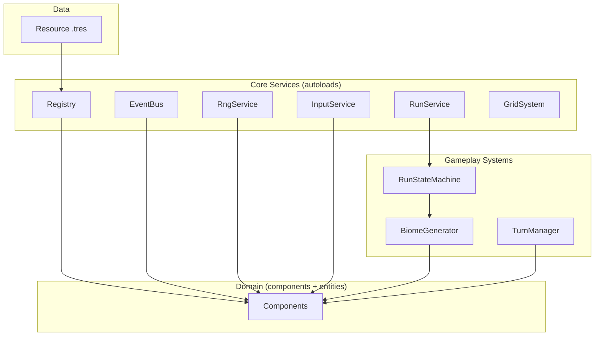

# Systems

The systems layer is the set of `Node`-based services that hold cross-cutting state or expose shared infrastructure. Each system is an autoload with a single, narrow responsibility. There is no `GameManager`.

## The "no God-object" rule

If a candidate service would need to know about more than one of: randomness, signals, content lookup, input mapping, run state, and grid geometry, it must be split. The current set of services maps one-to-one to those concerns.

## Autoloads

### `RngService` (Node, autoload)

The only source of randomness in gameplay code. Direct calls to `randi` / `randf` outside this service are forbidden.

| Method | Returns | Notes |
| --- | --- | --- |
| `set_seed(seed)` | `void` | Resets the internal `RandomNumberGenerator`. |
| `randi()` | `int` | |
| `randi_range(a, b)` | `int` | Inclusive. |
| `randf()` | `float` | |
| `randf_range(a, b)` | `float` | |
| `dice_roll(formula)` | `Dictionary` | Returns `{raw, total, rolls: Array[int]}` so callers can inspect the natural die for crit/fumble rules. |
| `pick(arr)` | `T` | Uniform random element. |
| `shuffle(arr)` | `Array` | Fisher–Yates; returns a new array. |
| `chance(p)` | `bool` | True with probability `p` in `[0, 1]`. |

Determinism: with the same seed and the same sequence of calls, the service must produce the same outputs. This is critical for biome reproducibility, replay, and testing.

### `EventBus` (Node, autoload)

A pure signal hub. No logic, no state. Any node can connect; no node owns the bus.

#### Core signals

| Signal | Payload | Emitted when |
| --- | --- | --- |
| `card_played` | `card: CardData`, `player: Character` | After a card resolves. |
| `damage_applied` | `amount: int`, `source: Character`, `target: Character`, `is_crit: bool` | After `DamageExecutor` resolves. |
| `heal_applied` | `amount: int`, `target: Character` | After `HealExecutor` resolves. |
| `entity_died` | `entity: Character` | When `HealthComponent.is_dead` becomes true. |
| `status_applied` | `data: StatusData`, `target: Character` | From `StatusComponent.apply_status`. |
| `status_removed` | `data: StatusData`, `target: Character` | From `StatusComponent.remove_status`. |
| `trophy_imbued` | `trophy: TrophyData`, `mouse: Character` | From `TrophyComponent.imbue`. |
| `turn_started` | `actor: Character` | When a new turn begins. |
| `turn_ended` | `actor: Character` | When an actor's turn ends. |
| `biome_entered` | `biome_data: BiomeData`, `seed: int` | On entering a biome. |
| `biome_exited` | `biome_data: BiomeData` | On exiting. |
| `predator_intent_published` | `predator: Character`, `plan: ActionPlan` | During `ENEMY_PLANNING`. |
| `rest_action_taken` | `action: StringName` | When the player uses a rest action. |
| `run_started` | `class_data: MouseClassData`, `seed: int` | |
| `run_ended` | `success: bool` | |

UI and analytics subscribe; gameplay code emits.

### `Registry` (Node, autoload)

Owns the four lookup tables described in `executors.md`:

- `effect_executors: Dictionary[StringName, Script]`
- `action_executors: Dictionary[StringName, Script]`
- `status_classes: Dictionary[StringName, Script]`
- `data_index: Dictionary[StringName, Resource]`

| Method | Returns | Notes |
| --- | --- | --- |
| `register_effect_executor(type_id, script)` | `void` | One-time, at boot. |
| `register_action_executor(type_id, script)` | `void` | One-time, at boot. |
| `register_status_class(id, script)` | `void` | Optional, only for statuses with custom runtime logic. |
| `index_data(resource)` | `void` | Called during startup scan. |
| `create_effect_executor(data)` | `EffectExecutor` | Throws if `data.type_id` is not registered. |
| `create_action_executor(data)` | `ActionExecutor` | Throws if `data.type_id` is not registered. |
| `get_data(id)` | `Resource` | O(1) id → resource lookup. |

On startup, `Registry` walks each theme folder (`res://attribute/`, `res://health/`, `res://stats/`, `res://dice/`, ...) recursively — skipping `*/tests/*` and `*.gd` — and loads every `Resource` whose filename matches its `id` field (or falls back to filename), then indexes it. The walk is `O(N)` where `N` is the total number of content files. There is no shared `res://data/` folder; content lives next to its theme's scripts.

### `InputService` (Node, autoload)

Translates Godot's `InputEvent` stream into logical intent signals. Brains consume these signals; they never read `InputEvent` directly.

| Signal | Payload | Triggered by |
| --- | --- | --- |
| `move_intent` | `direction: Vector2i` | `ui_move_*` actions. |
| `confirm_intent` | (none) | `ui_confirm`. |
| `cancel_intent` | (none) | `ui_cancel`. |
| `inspect_intent` | `cell: Vector2i` | Right-click or `inspect` action. |
| `card_play_intent` | `hand_index: int` | Left-click on a card in hand. |
| `basic_attack_intent` | (none) | `basic_attack` action. |
| `draw_cards_intent` | (none) | `card_discard_draw` action. |
| `wait_intent` | (none) | `wait` action. |
| `end_turn_intent` | (none) | `end_turn` action. |
| `rest_action_intent` | `action: StringName` | `confirm` while in a rest menu. |

This is the only place that knows Godot's action names. Swapping the input scheme (gamepad, touch) only changes this service.

### `RunService` (Node, autoload)

Holds the state of the in-progress run and the persistent meta-progression.

| Field | Type | Notes |
| --- | --- | --- |
| `current_run` | `RunState` (RefCounted) or `null` | The live run. |
| `persistent_unlocks` | `BurrowState` (RefCounted) | Survives across runs. |

| Method | Returns | Notes |
| --- | --- | --- |
| `start_run(class_data, seed)` | `void` | Builds the initial `RunState`, enters `BurrowState` to confirm class. |
| `end_run(success)` | `void` | Emits `run_ended`, clears `current_run`, persists unlocks. |
| `save_run` | `bool` | Serializes `current_run` to `user://saves/run.tres`. |
| `load_run` | `bool` | Restores the most recent run, if any. |
| `save_burrow` | `bool` | |
| `load_burrow` | `bool` | |

Persistence uses Godot's `ResourceSaver` and `ResourceLoader`. The in-slice vertical scope runs `current_run` purely in memory; persistence is part of `vertical-slice.md`'s out-of-scope list for the first deliverable.

### `GridSystem` (Node, scene-level, NOT autoloaded)

The authoritative store of "what is on each tile" for the current biome. A child of the active `Biome` scene. Exists only while the biome is current; freed with the biome on `BiomeState.exit`. There is no autoload registration; `GridSystem` is **not** a global singleton.

| Field | Type | Notes |
| --- | --- | --- |
| `occupants` | `Dictionary[Vector2i, Node]` | Tile → entity. |
| `blocked` | `Dictionary[Vector2i, bool]` | Tile → boolean. |

| Method | Returns | Notes |
| --- | --- | --- |
| `get_at(cell)` | `Node` or `null` | |
| `is_blocked(cell)` | `bool` | |
| `set_blocked(cell, value)` | `void` | |
| `neighbors(cell)` | `Array[Vector2i]` | The four orthogonal neighbors. |
| `bfs_path(a, b)` | `Array[Vector2i]` | Optional; for future path-following movement. |
| `register_entity(entity)` | `void` | Called by `GridPositionComponent.set_cell` on entry. |
| `unregister_entity(entity)` | `void` | Called on exit. |

The system is plain data with queries. It does not run game logic.

#### Wiring (injected, not autoloaded)

- `BiomeGenerator.generate` instantiates `GridSystem` as a child of the new `Biome` scene, and passes the reference into every spawned entity's `GridPositionComponent.grid` and `TargetingComponent.grid_ref`.
- `BiomeState` holds a reference (`self.grid`) for its own queries.
- `ActionContext.grid` is set to the current biome's `GridSystem` at action resolution time (by `TurnManager`).
- The component does not autoload-lookup `GridSystem`. It asserts that `grid` is assigned before the first `set_cell`.

## Other named systems (not autoloads)

### `BiomeGenerator` (Node, regular system)

Generates a `Biome` scene from a `BiomeData` and a seed. Deterministic: same seed → same layout.

| Method | Returns | Notes |
| --- | --- | --- |
| `generate(data, seed)` | `Biome` | The resulting scene root. |

The generator is constructed per-biome by the run state machine, given a fresh `RngService`-seeded RNG. It reads no global state.

The generator owns one `EntityFactory` (below) and uses it to spawn every entity in the biome. The generator also instantiates the biome's `GridSystem` as a child of the new `Biome` scene and passes the reference into every spawned entity's `GridPositionComponent.grid` and `TargetingComponent.grid_ref`.

### `EntityFactory` (Node, constructed per-biome)

Constructs entity scenes from data `Resource`s. The single place a `Predator` or `Corpse` is instantiated. Lives as a child of `BiomeGenerator` and is constructed per-biome.

| Method | Returns | Notes |
| --- | --- | --- |
| `spawn_predator(data, level)` | `Predator` | Instantiates `Predator.tscn`, applies `data` and `level`, returns the scene. |
| `spawn_corpse(predator_data)` | `Corpse` | Instantiates `Corpse.tscn` from a dead `Predator`'s `PredatorData`. |
| `spawn_collectable(data)` | `Recolectable` | When `Recolectable.tscn` exists. |

Caller: `BiomeGenerator.generate` (for initial spawns) and `BiomeState` (for mid-biome spawns such as summons).

The `Mouse` is **not** built by `EntityFactory`: the Mouse is the one persistent entity per run, instantiated once by `RunStateMachine.start_run` and reparented across biomes (see [`entities.md`](./entities.md) §`Mouse persistence rule`).

### `TurnManager` (Node, autoload)

Drives the per-turn cycle. Detailed in `run-flow.md`. It is an autoload because turn state must outlive scene changes (e.g., between biomes the `TurnManager` resets, but the autoload itself stays).

### `RunStateMachine` (Node, autoload)

Owns the current `RunState`. Detailed in `run-flow.md`.

## Layered view of services

