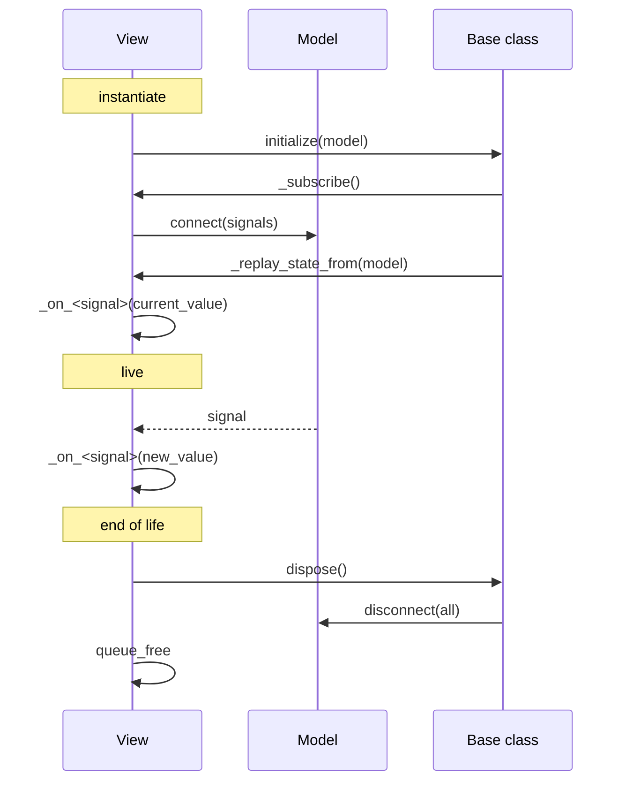

# Views

The model is designed. The consumer of the model is not — until this document. Views are the layer that was assumed but never written down. They live between the [domain](./components.md) and the player, they own no gameplay state, and they are disposable.

[`principles.md`](./principles.md) §7 names the only view that existed before this document: *"the visual representation of a card is a `CardView` Control scene, which is a view, not an entity."* This document names the rest and pins the contract every view honors.

## Layer position

Inside the [PRESENTATION band](./README.md) of the architecture, views split into two sub-layers that share a single contract:

| Sub-layer | Where it lives | Lifespan |
| --- | --- | --- |
| **World views** | As children of the model scene they observe (e.g. `MouseView` is a child of `Mouse.tscn`). | Tied to the model's lifespan; freed with it. |
| **HUD views** | As children of the persistent `HUDController` in the main scene tree. | Tied to the run; re-bound when a biome is entered. |

A view depends on its model. A view never depends on another view. Two views that both observe the same `HealthComponent` do not know about each other.

```
+--------------------------------------------------------------+
|  PRESENTATION                                                |
|                                                              |
|  +-----------------------+   +-----------------------------+ |
|  |  World views          |   |  HUD views                  | |
|  |  (MouseView, etc.)    |   |  (HUDController, etc.)      | |
|  +-----------+-----------+   +--------------+--------------+ |
|              |                             |                 |
|              v                             v                 |
|  +-------------------------------------------------+        |
|  |  View contract (View base class)                 |        |
|  +-------------------------------------------------+        |
+--------------------------------------------------------------+
                              |
                              v   signals, never direct calls
+--------------------------------------------------------------+
|  DOMAIN  (components on Mouse, Predator, Corpse)            |
+--------------------------------------------------------------+
```

## The `View` base class

`View` is the single contract every world view and every HUD view honors. The contract is intentionally minimal: the base owns the lifecycle, the subscribers own the behavior.

| Field | Type | Notes |
| --- | --- | --- |
| `_model` | `Node` | The model this view is bound to. `null` until `initialize(...)` is called. |
| `_disposed` | `bool` | `true` after `dispose()` returns; further updates are no-ops. |

| Method | Returns | Notes |
| --- | --- | --- |
| `initialize(model: Node)` | `void` | Stores `_model`, calls `_subscribe()`, then calls `_replay_state_from(_model)`. Throws if called twice on the same view. |
| `_subscribe()` | `void` | Virtual. Subclasses `connect()` the signals they care about. Order of `connect()` calls is the order of declaration in the subclass. |
| `_on_<signal_name>(...)` | `void` | Virtual. One handler per signal. Named after the signal in `snake_case` with an `_on_` prefix. |
| `_replay_state_from(model: Node)` | `void` | Virtual. Subclasses read the model's current values for each signal they subscribe to, then invoke the matching `_on_<signal_name>` handler. Guarantees the view is correct on the frame it becomes visible. |
| `dispose()` | `void` | Disconnects every signal connected in `_subscribe()`, frees any transient children the view created (e.g. `CardView` instances), and sets `_disposed = true`. Idempotent. |

The base class provides the invariant: once `dispose()` returns, the view will not modify any node. The model keeps emitting; the view ignores it.

### Anti-patterns in the base class

| Tempting (rejected) | Correct |
| --- | --- |
| View holds gameplay state (e.g. a cached `current_hp` int). | View holds display state only (e.g. a `ProgressBar.value`); truth lives on the model. |
| View reaches into another view. | Both views observe the same model independently. |
| View calls `EventBus.emit(...)`. | View emits its own local signal; if the system needs the event globally, the model or a service emits it. |
| View autoload-looks-up `RngService`, `EventBus`, etc. | View receives what it needs in `initialize()`; nothing else. |

## The view lifecycle



The view becomes visible after `_replay_state_from` returns, before the first frame. The order of `connect()` calls in `_subscribe()` is the order of declaration in the subclass — tests in `view/tests/` assert on it.

## Current-state replay

A model can be loaded mid-run with non-default state (a save file, a level-up, a status that was applied before the view existed). The view must show the truth on frame 0, not wait for the first signal to fire. `_replay_state_from` is the mechanism that guarantees this.

| View | Reads | Invokes |
| --- | --- | --- |
| `HpBarWidget` | `HealthComponent.current_hp`, `HealthComponent.max_hp` | `_on_hp_changed(current, max)` |
| `HpBarWidget` | `HealthComponent.is_wounded()` | `_on_wounded_state_changed(is_wounded)` |
| `EnergyMeterWidget` | `StatsComponent.current_energy`, `StatsComponent.max_energy` | `_on_energy_changed(current, max)` |
| `LevelXpWidget` | `StatsComponent.level`, `StatsComponent.xp`, `StatsComponent.xp_to_next` | `_on_level_up(level)`, `_on_xp_gained(amount)` |
| `HandUI` | `DeckComponent.hand` | `_on_hand_changed()` |
| `MouseView` | `HealthComponent.current_hp`, `HealthComponent.max_hp` | `_on_hp_changed(current, max)` |
| `MouseView` | `GridPositionComponent.cell` | `_on_cell_changed(old, new)` |
| `PredatorView` | `HealthComponent.current_hp`, `HealthComponent.max_hp` | `_on_hp_changed(current, max)` |
| `PredatorView` | `IntentComponent.current_intent` | `_on_intent_published(plan)` |
| `CorpseView` | `CorpseComponent.current_hp`, `CorpseComponent.essence_remaining` | `_on_corpse_hp_changed`, `_on_essence_changed` |
| `WorldHealthBar` | same as `HpBarWidget` (different model instance per actor) | same |

The replay reads happen in the order the entries appear in this table, left to right. The base class calls the virtual in the same order it called `_subscribe()`.

## World views

World views are children of the model scenes they observe. They die with the model.

### `MouseView` (Node, scene: `view/mouse_view.tscn`)

| Field | Type | Notes |
| --- | --- | --- |
| `sprite` | `Sprite2D` | Idle, move, and hit sprite. |
| `animation_player` | `AnimationPlayer` | Move, hit-flash, death animations. |
| `selection_ring` | `Node2D` | Highlight ring when the mouse is the active actor. |
| `world_health_bar` | `WorldHealthBar` | Child view. |

| Signal subscribed | Source component | Handler |
| --- | --- | --- |
| `hp_changed(current, max)` | `HealthComponent` | `_on_hp_changed` — plays a hit-flash on damage, a heal-flash on increase. |
| `wounded_state_changed(is_wounded)` | `HealthComponent` | `_on_wounded_state_changed` — tints the sprite red. |
| `died(cause, killer)` | `HealthComponent` | `_on_died` — plays the death animation; the parent scene frees the `Mouse` (which frees `MouseView` with it). |
| `cell_changed(old, new)` | `GridPositionComponent` | `_on_cell_changed` — tweens the sprite to the new cell. |
| `status_applied(data)` | `StatusComponent` | `_on_status_applied` — adds an icon to the status row. |
| `status_removed(data)` | `StatusComponent` | `_on_status_removed` — removes the icon. |

Disposal: tied to `Mouse.queue_free`. The base class's `dispose()` is invoked from `_exit_tree()`.

### `PredatorView` (Node, scene: `view/predator_view.tscn`)

| Field | Type | Notes |
| --- | --- | --- |
| `sprite` | `Sprite2D` | |
| `animation_player` | `AnimationPlayer` | |
| `status_icon_row` | `HBoxContainer` | One icon per active status. |
| `world_health_bar` | `WorldHealthBar` | Child view. |

| Signal subscribed | Source component | Handler |
| --- | --- | --- |
| `hp_changed(current, max)` | `HealthComponent` | `_on_hp_changed` — hit-flash. |
| `wounded_state_changed(is_wounded)` | `HealthComponent` | `_on_wounded_state_changed` — tint. |
| `died(cause, killer)` | `HealthComponent` | `_on_died` — death animation; the `Predator` becomes a `Corpse` and `PredatorView` is disposed in the same frame. |
| `intent_published(plan)` | `IntentComponent` | `_on_intent_published` — plays the "preparing" animation. |
| `intent_cleared` | `IntentComponent` | `_on_intent_cleared` — clears the animation. |
| `status_applied(data)` | `StatusComponent` | `_on_status_applied` — icon. |
| `status_removed(data)` | `StatusComponent` | `_on_status_removed` — icon. |

Disposal: tied to `Predator.queue_free` (biome exit, death → becomes `Corpse`).

### `CorpseView` (Node, scene: `view/corpse_view.tscn`)

| Field | Type | Notes |
| --- | --- | --- |
| `sprite` | `Sprite2D` | The dead predator's sprite, desaturated. |
| `loot_glow` | `Node2D` | Pulses when the mouse is on the corpse's tile. |

| Signal subscribed | Source component | Handler |
| --- | --- | --- |
| `destroyed` | `CorpseComponent` | `_on_destroyed` — plays the destruction animation, then `queue_free`. |

Disposal: triggered by `CorpseComponent.destroyed`.

### `WorldHealthBar` (Node, scene: `view/world_health_bar.tscn`)

A child of `MouseView` and `PredatorView`. One per actor.

| Signal subscribed | Source component | Handler |
| --- | --- | --- |
| `hp_changed(current, max)` | `HealthComponent` | `_on_hp_changed` — updates the `ProgressBar.value`. |
| `wounded_state_changed(is_wounded)` | `HealthComponent` | `_on_wounded_state_changed` — reveals the wounded marker. |

Visibility: hidden when `current_hp == max_hp` and not `is_wounded()`. Shown otherwise.

Disposal: follows its parent view.

### `FloatingDamageView` (Control, scene: `view/floating_damage_view.tscn`)

A transient Control instantiated by a `DamageSpawner` (a child `Node` of the active `Biome` scene, not a global autoload). One per damage event.

This is the only view allowed to subscribe to `EventBus`, because the event carries the position the spawner needs and the view is genuinely a side-effect of an event, not an observer of a model.

| Signal subscribed | Source | Handler |
| --- | --- | --- |
| `damage_applied(amount, source, target, is_crit)` | `EventBus` | `_on_damage_applied` — reacts only if the event's tile overlaps the spawner's `Biome`; otherwise no-op. |

Lifetime: 0.6s tween upward, then `queue_free`. The base class's `dispose()` is invoked from `_exit_tree()`.

## UI views

UI views are children of a persistent `HUDController`. They survive biome transitions; they are re-bound to a new model on each biome entry.

### `HUDController` (Node, scene: `view/hud_controller.tscn`)

Not itself a `View`. It is a controller that owns the lifecycle of its widget children. It lives in the main scene tree, not in the `Biome` scene.

| Field | Type | Notes |
| --- | --- | --- |
| `hp_bar_widget` | `HpBarWidget` | |
| `energy_meter_widget` | `EnergyMeterWidget` | |
| `level_xp_widget` | `LevelXpWidget` | |
| `essence_counter_widget` | `EssenceCounterWidget` | |
| `hand_ui` | `HandUI` | |
| `intent_overlay` | `IntentOverlay` | Shown only inside a biome. |

| Method | Returns | Notes |
| --- | --- | --- |
| `on_biome_entered(mouse: Character)` | `void` | Calls `initialize(mouse)` on every widget that observes the mouse; calls `show()` on `intent_overlay`. |
| `on_biome_exited()` | `void` | Calls `dispose()` on every widget that was bound; calls `hide()` on `intent_overlay`. |

`on_biome_entered` and `on_biome_exited` are called by `BiomeState` (see [`run-flow.md`](./run-flow.md)).

### `HpBarWidget` (Control, scene: `view/hp_bar_widget.tscn`)

| Signal subscribed | Source component | Handler |
| --- | --- | --- |
| `hp_changed(current, max)` | `HealthComponent` | `_on_hp_changed` — sets `ProgressBar.value`. |
| `wounded_state_changed(is_wounded)` | `HealthComponent` | `_on_wounded_state_changed` — updates the wounded marker. |

Disposal: via `HUDController.on_biome_exited`.

### `EnergyMeterWidget` (Control, scene: `view/energy_meter_widget.tscn`)

| Signal subscribed | Source component | Handler |
| --- | --- | --- |
| `energy_changed(current, max)` | `StatsComponent` | `_on_energy_changed` — sets `ProgressBar.value`. |
| `max_changed(which, value)` | `StatsComponent` | `_on_max_changed` — re-clamps `ProgressBar.max_value`. |

Disposal: via `HUDController.on_biome_exited`.

### `LevelXpWidget` (Control, scene: `view/level_xp_widget.tscn`)

| Signal subscribed | Source component | Handler |
| --- | --- | --- |
| `level_up(new_level)` | `StatsComponent` | `_on_level_up` — updates the level label; replays the xp bar. |
| `xp_gained(amount)` | `StatsComponent` | `_on_xp_gained` — tweens the xp bar. |

Disposal: via `HUDController.on_biome_exited`.

### `EssenceCounterWidget` (Control, scene: `view/essence_counter_widget.tscn`)

| Signal subscribed | Source | Handler |
| --- | --- | --- |
| `essence_changed(current)` | `RunService` | `_on_essence_changed` — sets the label text. |

`RunService` exposes this signal when the run's essence mutates (loot, spend). Until that signal exists, the widget falls back to reading the run state on `initialize()` and on the `EventBus.run_ended` event; the fallback is replaced once the signal is in place.

Disposal: never disposed mid-run; lives for the lifetime of the run.

### `HandUI` (Control, scene: `view/hand_ui.tscn`)

| Signal subscribed | Source component | Handler |
| --- | --- | --- |
| `hand_changed` | `DeckComponent` | `_on_hand_changed` — rebuilds its children. |

`_on_hand_changed` instantiates one `CardView` per `CardData` in `hand`, parents each to the hand container, and frees any `CardView`s from the previous state. The hand size is read from `DeckComponent.max_hand_size` during the rebuild.

Disposal: via `HUDController.on_biome_exited`. The base class's `dispose()` frees the current `CardView` children.

### `CardView` (Control, scene: `view/card_view.tscn`)

A transient `Control`. Bound to a `CardData` `Resource`, not a `Node`. The `HandUI` constructs it; the `HandUI` disposes it. The card data is reference-counted and persists.

| Field | Type | Notes |
| --- | --- | --- |
| `data` | `CardData` | The card this view represents. |
| `card_art` | `TextureRect` | |
| `name_label` | `Label` | |
| `energy_cost_label` | `Label` | |
| `description_label` | `RichTextLabel` | Shown on hover. |
| `disabled_overlay` | `ColorRect` | Visible when the player lacks the energy. |

`CardView` is **not** a `View` subclass. It carries no `initialize(_)` / `dispose()` lifecycle: it is created and freed wholesale by `HandUI`. The card data is inert, so there are no signals to subscribe to. Visual reactions (e.g. "this card can be played", "selected for targeting") are driven by the `HandUI`'s state, set via direct method calls on `CardView`: `set_playable(bool)` and `set_selected(bool)`.

### `IntentOverlay` (Control, scene: `view/intent_overlay.tscn`)

A `Control` overlay drawn above the `Biome` viewport. Shown only inside a biome.

| Signal subscribed | Source | Handler |
| --- | --- | --- |
| `intent_published(plan)` | every `Predator.IntentComponent` | `_on_intent_published` — highlights the affected tiles. |
| `intent_cleared` | every `Predator.IntentComponent` | `_on_intent_cleared` — clears the highlights. |

The overlay subscribes to every predator when the `Biome` is entered, and unsubscribes when the `Biome` is exited. `BiomeState` provides the predator list.

Disposal: tied to the `Biome` scene's free. The base class's `dispose()` is invoked from `_exit_tree()`.

### `TargetingReticle` (Control, scene: `view/targeting_reticle.tscn`)

A `Control` that follows the mouse cursor over valid target tiles. State: `idle`, `selecting_target`, `confirming`. Driven by `InputService` intents and the mouse's `TargetingComponent`.

| Signal subscribed | Source | Handler |
| --- | --- | --- |
| `move_intent(direction)` | `InputService` | `_on_move_intent` — moves the reticle one tile. |
| `confirm_intent` | `InputService` | `_on_confirm_intent` — transitions to `confirming`. |
| `cancel_intent` | `InputService` | `_on_cancel_intent` — transitions to `idle`. |
| `inspect_intent(cell)` | `InputService` | `_on_inspect_intent` — highlights the tile. |

The reticle does not directly call `TargetingComponent.reachable_tiles(max_range)` from a signal handler. It polls the component on each `move_intent` because the reachable set can change (a tile becomes blocked, a predator dies). This is the one place a view is allowed to query a model rather than observe it.

Disposal: tied to the main scene's free.

## Single source of truth in practice

The single-source-of-truth rule is enforceable through the view contract. There is one `HealthComponent` on the `Mouse` model, and three observers:

```
Mouse.HealthComponent
        │
        ├── HpBarWidget            (HUD)
        ├── WorldHealthBar         (world, child of MouseView)
        └── MouseView              (hit-flash, only on damage direction)
```

All three subscribe to the same `HealthComponent` instance via the same `connect(hp_changed, ...)` mechanism. None of them hold a copy of `current_hp`. If a future contributor creates a second `HealthComponent` (e.g. as a child of `MouseView`), the architecture review checklist (referenced from [`vertical-slice.md`](./vertical-slice.md)'s risk list) flags it.

## Disposal on biome transition

| View | Trigger |
| --- | --- |
| `MouseView` | `Mouse.queue_free` (on `RunEndState` or `BiomeState.exit` if a new mouse is needed — not currently in the GDD). |
| `PredatorView` | `Predator.queue_free` (biome exit, predator death → becomes `Corpse`). |
| `CorpseView` | `CorpseComponent.destroyed` (after the destruction animation). |
| `WorldHealthBar` | follows its parent view. |
| `FloatingDamageView` | after its tween completes (0.6s). |
| `HUDController` | never disposed mid-run. |
| `HpBarWidget` | `dispose()` on `BiomeState.exit`; re-`initialize()` on next biome. |
| `EnergyMeterWidget` | `dispose()` on `BiomeState.exit`; re-`initialize()` on next biome. |
| `LevelXpWidget` | `dispose()` on `BiomeState.exit`; re-`initialize()` on next biome. |
| `EssenceCounterWidget` | never disposed mid-run. |
| `HandUI` | `dispose()` on `BiomeState.exit`. |
| `CardView` | when `HandUI` rebuilds its children, or on `BiomeState.exit`. |
| `IntentOverlay` | when the `Biome` scene is freed. |
| `TargetingReticle` | on `end_turn_intent` or `cancel_intent`. |

`dispose()` is idempotent. The base class sets the `_disposed` flag; calling it twice is a no-op.

## View placement in the scene tree

The runtime tree when a biome is active:

```mermaid
graph TD
    Main[Main]
    Main --> HUD[HUD]
    HUD --> HC[HUDController]
    HC --> HPB[HpBarWidget bound to Mouse]
    HC --> EMW[EnergyMeterWidget bound to Mouse]
    HC --> LXW[LevelXpWidget bound to Mouse]
    HC --> ECW[EssenceCounterWidget bound to RunService]
    HC --> HandUI[HandUI bound to Mouse.DeckComponent]
    HC --> IO[IntentOverlay bound to every Predator.IntentComponent]
    Main --> Biome
    Biome --> Mouse[Mouse model]
    Mouse --> MA[AttributeComponent]
    Mouse --> MS[StatsComponent]
    Mouse --> MH[HealthComponent]
    Mouse --> MF[FactionComponent]
    Mouse --> MG[GridPositionComponent]
    Mouse --> MAB[ActionBudgetComponent]
    Mouse --> MT[TargetingComponent]
    Mouse --> MS2[StatusComponent]
    Mouse --> MD[MouseDeckComponent]
    Mouse --> MM[MemorizationComponent]
    Mouse --> MT2[TrophyComponent]
    Mouse --> MV[MouseView]
    MV --> Sprite[Sprite2D]
    MV --> Anim[AnimationPlayer]
    MV --> SR[SelectionRing]
    MV --> WHB[WorldHealthBar bound to Mouse.HealthComponent]
    Biome --> P[Predator x N]
    P --> PV[PredatorView]
    Biome --> C[Corpse x M]
    C --> CV[CorpseView]
    Biome --> DS[DamageSpawner]
    DS -.spawns.-> FDV[FloatingDamageView instances]
```



A `View` is never a child of a model that contains gameplay state. It may be a child of the same parent that owns the model (the world views), or it may be in a different scene entirely (the HUD). The diagram enforces this: world views are children of the same parent that owns the model; HUD views are children of the HUD.

## Anti-patterns

| Tempting (rejected) | Correct |
| --- | --- |
| `MouseView` holds a cached `current_hp` int and updates it from the signal. | `MouseView` reads `HealthComponent.current_hp` on every frame it needs to render; the model is the truth. |
| `CardView` is a `Node` added to the `Mouse` scene. | `CardView` is a `Control` created by `HandUI` and disposed when the card leaves the hand. |
| The HUD reads `RngService` to randomize a damage number display. | The HUD reads the deterministic `damage_applied` payload; no RNG. |
| A view subscribes to `EventBus` to learn about the mouse's HP. | The view subscribes to the mouse's `HealthComponent.hp_changed` directly. (Exception: `FloatingDamageView`, above.) |
| A view holds a reference to another view. | Views are siblings; if they need to coordinate, the model coordinates. |
| `HandUI` knows which `CardData` the player has selected. | `HandUI` is told via `InputService.card_play_intent(hand_index)`, then asks the model to play the card. The model coordinates. |

## Composition table

| Model | World views | UI views |
| --- | --- | --- |
| `Mouse` | `MouseView`, `WorldHealthBar` | `HpBarWidget`, `EnergyMeterWidget`, `LevelXpWidget`, `HandUI` |
| `Predator` | `PredatorView`, `WorldHealthBar` | `IntentOverlay` (read-only) |
| `Corpse` | `CorpseView` | (none) |
| `EventBus.damage_applied` | `FloatingDamageView` (per event) | (none) |
| `RunService.current_run` | (none) | `EssenceCounterWidget` |

The asymmetry is intentional: world and UI do not observe the same set of models. The HUD observes run-level state too (`RunService`); the world does not.

## Where this doc fits

This document is the ninth file in the [architecture folder](./README.md). It depends on:

- [`principles.md`](./principles.md) for the "disposable views, persistent models" rule.
- [`data-model.md`](./data-model.md) for the data types views render.
- [`components.md`](./components.md) for every signal a view subscribes to.
- [`systems.md`](./systems.md) for `EventBus` and `InputService` (the two non-model sources a view is allowed to read from).
- [`run-flow.md`](./run-flow.md) for the `BiomeState` lifecycle that drives HUD binding.
- [`entities.md`](./entities.md) for the model scenes the views are children of.

It is the source of truth for:

- The `View` base class API (`initialize`, `dispose`, `_subscribe`, `_replay_state_from`).
- The per-view signal subscriptions and handler names.
- The disposal policy on biome transition.
